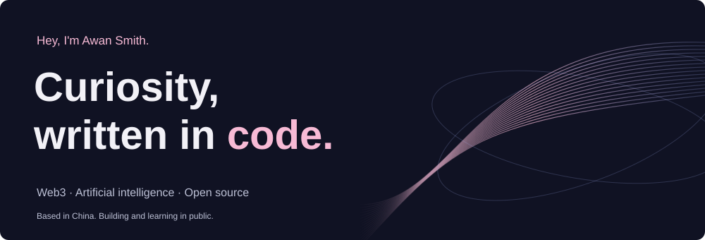

  

  

  <a href="https://github.com/gunksd">GitHub</a> ·
  <a href="https://x.com/wnyn12075574">X / Twitter</a> ·
  <a href="https://www.awansmith.cn/">Personal blog</a>

## Hey, I'm Awan 👋

An aspiring Web3 developer from China, exploring smart contracts, on-chain ecosystems, and the intersection of AI with decentralized systems. I learn by building and share what I discover through technical writing.

**Blockchain** · Solidity, Move, Ethereum, Sui, Rooch, Axelar 
**Development** · Python, JavaScript, Vue.js 
**Research** · Deep learning, neural networks, quantitative trading

### What I'm exploring

- [x] Built a machine learning-based quantitative trading system
- [ ] Exploring AI + Web3 integration projects
- [ ] Contributing to open-source blockchain ecosystems

### Education

[Jiangsu University](https://www.ujs.edu.cn/) · September 2022 – July 2026 · Graduated 
School of Computer Science and Communications Engineering 
Intelligent Science and Technology

### Contribution trail

<picture>
  <source media="(prefers-color-scheme: dark)" srcset="https://raw.githubusercontent.com/gunksd/gunksd/output/github-contribution-grid-snake-dark.svg">
  
</picture>

More GitHub statistics

  
  

---

[React portfolio source & local preview instructions](website/README.md) · [Profile maintenance notes](docs/maintenance.md)
